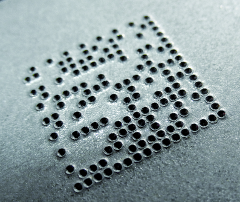
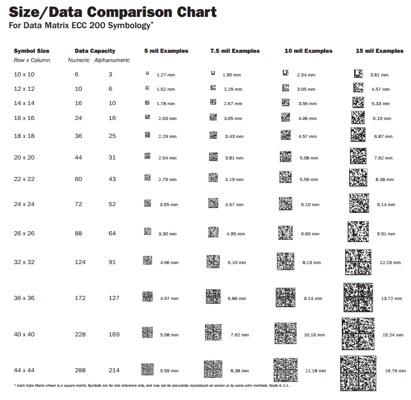

## Die Markings
What we are looking for with markings on dies

## Requirements
- pin 1 marking - **visible without specialized equpiment*
- Global Identifier
    
## Global ID Marking
We would like to have access to all this info somehow
    - process
    - run #
    - project id
    - mfr date
    - point to source files

#### QR Code 
https://en.wikipedia.org/wiki/QR_Code

#### Data Matrix
https://en.wikipedia.org/wiki/Data_Matrix

Data matrix is my personal choice for now. 

At macro scales this can also be used as pin 1 designator

They also can be dots and not full squares.  

### Technical

Per [previous discussion](https://github.com/wafer-space/reticle-stitcher/issues/1) markings will be on [metal top layer](https://gf180mcu-pdk.readthedocs.io/en/latest/physical_verification/design_manual/drm_07_16.html) constraining pixels to a minimum size of 0.75um

