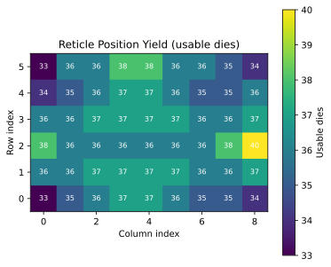

# die_yield_helper.py

A utility script for analyzing and processing wafer die yield data.

## Overview

`die_yield_helper.py` provides functions to calculate yield metrics and generate pick maps for wafer die sorting operations. 

## Example Output

```
Total usable dies: 1951,
Die count array shape: (6, 9),
[[33 35 36 37 37 36 35 35 34]
 [36 36 37 37 37 37 36 36 37]
 [38 36 36 36 36 36 36 38 40]
 [36 36 37 37 37 37 36 36 37]
 [34 35 36 37 37 36 35 35 36]
 [33 36 36 38 38 36 36 35 34]]
```



